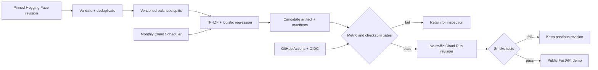

# ReviewSignal

[](https://github.com/deshmukh-neel/amazon-review-sentiment-mlops/actions/workflows/ci.yml)
[](https://github.com/deshmukh-neel/amazon-review-sentiment-mlops/actions/workflows/security.yml)
[](https://www.python.org/downloads/release/python-3110/)
[](LICENSE)

**A reproducible Amazon-review sentiment system with model lineage, quality gates, a privacy-safe FastAPI demo, and serverless GCP delivery.**

ReviewSignal turns an MSDS group project into a production-shaped ML/MLOps portfolio project. It resolves a pinned source revision, creates deterministic balanced splits, trains and evaluates a classical NLP model, verifies model checksums at load time, and separates monthly candidate creation from explicit production promotion.

> **Live on GCP:** [try the ReviewSignal demo](https://reviewsignal-6amzjx52nq-uc.a.run.app/) or [explore the OpenAPI docs](https://reviewsignal-6amzjx52nq-uc.a.run.app/docs). The scale-to-zero Cloud Run service currently serves model `20260807T211915Z-2a070c1` from project `mlops-491820`.

## Measured result

The release candidate was trained from the full pinned dataset on August 7, 2026. The held-out test set was never used for model selection.

| Metric | Validation | Test |
| --- | ---: | ---: |
| Accuracy | 0.9155 | **0.9153** |
| Macro F1 | 0.9155 | **0.9153** |
| Precision (positive) | 0.9174 | **0.9162** |
| Recall (positive) | 0.9132 | **0.9142** |
| ROC-AUC | 0.9716 | **0.9729** |
| Dummy macro F1 | 0.3333 | **0.3333** |
| Model-only latency¹ | 0.27 ms | **0.27 ms** |

The candidate improves test macro-F1 over the most-frequent dummy baseline by **0.5820**. Its compressed artifact is **990,318 bytes** (about 968 KiB).

¹ Single-record `predict_proba` latency averaged over 25 repetitions on local Apple Silicon. It excludes network, container cold-start, and request-parsing time.

[Full model card](docs/model-card/README.md) · [Versioned release metrics](docs/metrics/v1-candidate-metrics.json) · [Data card](docs/data-card/README.md)

## System design



The scheduled job creates candidates only and is permission-scoped to the `candidates/` prefix. A manual, protected GitHub workflow pins the candidate generations, verifies the candidate against production inside a credential-free container, deploys it without traffic, smoke-tests the tagged revision, and then moves traffic. Only after the public checks pass does a generation-guarded production pointer update occur; a failure restores the exact prior traffic allocation.

## What this demonstrates

- **Reproducibility:** pinned `mteb/amazon_polarity` revision, complete source and materialized-split checksums, seed `42`, exact parameters, locked dependencies, and immutable manifests.
- **Model quality:** accuracy, macro F1, precision, recall, ROC-AUC, confusion matrices, dummy comparison, artifact size, and inference latency.
- **Safe serving:** typed request/response contracts, readiness after checksum-verified loading, request IDs, and logs that never contain submitted review text.
- **Gated delivery:** PR tests and Terraform plans, post-CI immutable Git-SHA images, no-traffic code/model validation, generation-guarded pointers, traffic migration, and rollback.
- **Cloud engineering:** Terraform-managed private buckets, Artifact Registry, Cloud Run service/job, Scheduler, least-privilege IAM, monitoring, budgets, and repository-scoped Workload Identity Federation.

## Run it locally

Requirements: Python 3.11 and [uv](https://docs.astral.sh/uv/).

```bash
uv sync --frozen
uv run pytest --cov=reviewsignal
```

Create a tiny model without downloading the production corpus:

```bash
uv run reviewsignal pipeline \
  --fixture tests/fixtures/tiny_reviews.jsonl \
  --data-dir /tmp/reviewsignal-data \
  --model-dir /tmp/reviewsignal-models \
  --train-size 16 \
  --validation-size 8 \
  --test-size 8
```

The command prints the candidate manifest path. Start the app with that manifest:

```bash
MODEL_MANIFEST_PATH=/tmp/reviewsignal-models/<model-version>/model-manifest.json \
  uv run uvicorn reviewsignal.api:app --host 127.0.0.1 --port 8000
```

Open `http://127.0.0.1:8000` for the responsive demo or `http://127.0.0.1:8000/docs` for OpenAPI.

### Production-sized local run

This downloads the pinned upstream dataset, creates 80,000/10,000/10,000 splits, and trains a candidate. Raw downloads, splits, and models are ignored by Git.

```bash
uv run reviewsignal pipeline
```

Run individual stages with `reviewsignal ingest`, `reviewsignal train`, and `reviewsignal evaluate --model-manifest <path>`.

## API contract

```http
POST /api/v1/predict
Content-Type: application/json

{"text":"Excellent quality and fast shipping."}
```

```json
{
  "label": "positive",
  "positive_probability": 0.98,
  "model_version": "20260807T211915Z-2a070c1",
  "request_id": "3bdb4135-2a53-4374-85ec-4034f2a2aa59"
}
```

The service also exposes `GET /api/v1/model`, `GET /health`, `GET /healthz`, `GET /readyz`, and `GET /docs`. [Cloud Run reserves some paths ending in `z`](https://docs.cloud.google.com/run/docs/known-issues#reserved_url_paths), so cloud liveness probes use `/health`; `/healthz` remains available when the container is run directly. Prediction input must contain 1–5,000 nonblank characters.

## Repository map

| Path | Purpose |
| --- | --- |
| `src/reviewsignal/` | Ingestion, manifests, training, artifact verification, API, and web demo |
| `tests/` | Unit, API, storage, privacy, and synthetic end-to-end tests |
| `infra/terraform/` | GCP service, job, storage, registry, IAM, monitoring, budget, and state bootstrap |
| `.github/workflows/` | CI, security, Terraform plan, deploy, and gated promotion workflows |
| `docs/` | Architecture, data/model cards, costs, deployment, and project evolution |
| `legacy/airflow/` | Historical MongoDB Atlas → GCS Cloud Composer DAG |
| `notebooks/` | Cleaned historical MongoDB and PySpark notebooks |

## Data, privacy, and limitations

Git contains only a tiny synthetic fixture. Source corpora, materialized splits, manifests containing private bucket URIs, and model artifacts stay outside the repository. Production objects use private versioned GCS buckets.

Review text sent to the demo is processed in memory and is never persisted or logged. The classifier is binary, English-only, and intended for demonstration—not moderation, customer scoring, or other consequential decisions. It can fail on sarcasm, mixed sentiment, unfamiliar domains, dialects, and adversarial text.

## Project evolution

The work began as an MSDS group project using Amazon Reviews'23 Video Games data, MongoDB Atlas, PySpark, and Cloud Composer. The production rework preserves the notebooks, DAG, citation, and privacy-cropped screenshots as historical evidence while replacing the live architecture with a smaller, reproducible, scale-to-zero system.

[Read the project-evolution narrative](docs/project-evolution.md) · [Architecture](docs/architecture/README.md) · [Deployment and rollback](docs/deployment.md) · [Cost model](docs/costs.md)

## License and attribution

Project code is [MIT licensed](LICENSE). Dataset terms remain separate. The historical work used [Amazon Reviews'23](https://amazon-reviews-2023.github.io/) from McAuley Lab. The production path uses [`mteb/amazon_polarity`](https://huggingface.co/datasets/mteb/amazon_polarity), whose dataset card identifies Apache-2.0 terms. Neither corpus is redistributed here.
