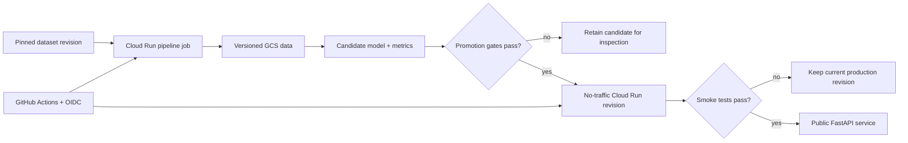

# Architecture

ReviewSignal separates reproducible model creation from public inference. A scheduled Cloud Run Job reads a pinned dataset revision, validates deterministic splits, trains a candidate, and writes immutable artifacts to private Cloud Storage. Candidate models do not receive production traffic automatically.

## Runtime boundaries

- The training job can create objects only under versioned-data and candidate-model prefixes; it cannot overwrite, delete, or write production objects.
- The public service can only read the exact production-model bucket.
- GitHub Actions receives short-lived GCP credentials through workflow-specific Workload Identity Federation bindings. Code deploy, model promotion, and read-only Terraform plan use separate identities.
- Each service revision loads an immutable manifest URI and verifies the model SHA-256 before deserialization.
- Submitted review text exists only for the lifetime of one HTTP request and is excluded from logs.

## Cost controls

The service uses zero minimum instances and two maximum instances. The training job runs monthly and exits. Storage lifecycle policies cover archived generations. Container cleanup deletes old images after 90 days while preserving at least the five newest versions.
