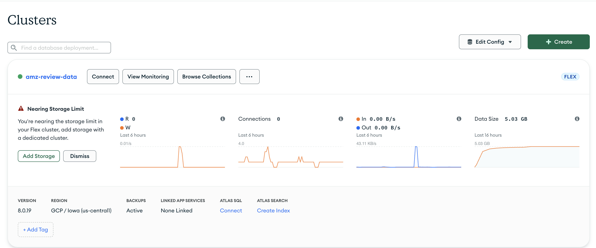
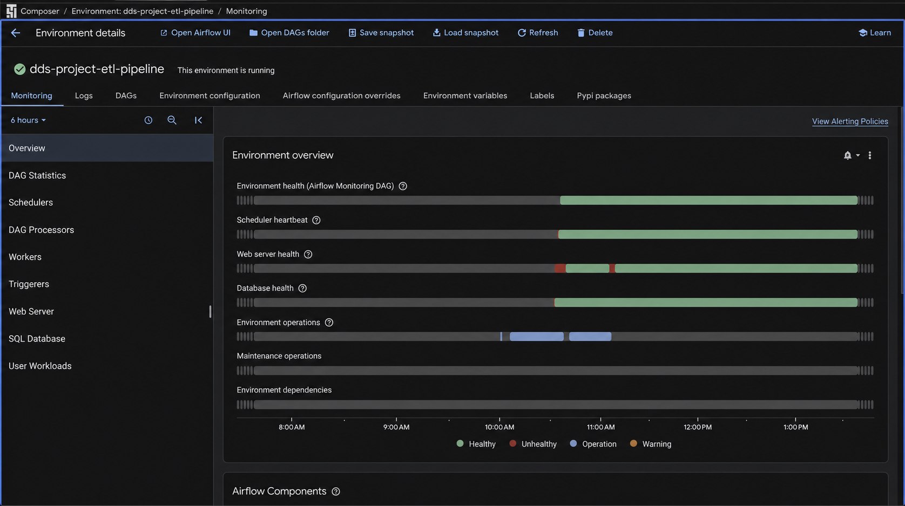
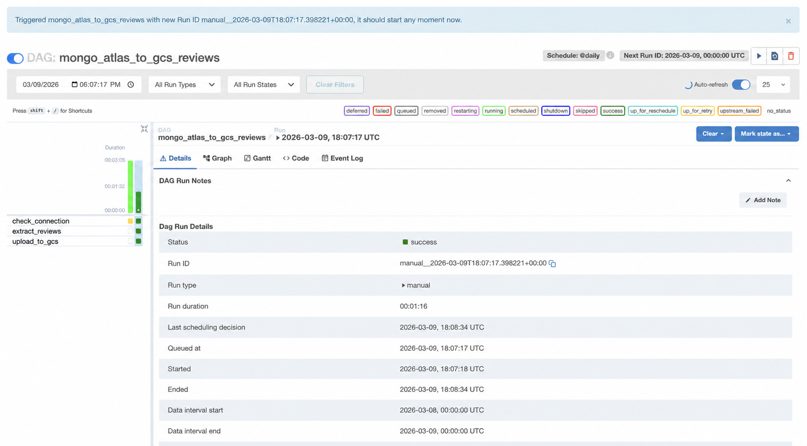

# From class pipeline to portfolio system

ReviewSignal began as an MSDS group project exploring Amazon Reviews'23 Video Games data with MongoDB Atlas, PySpark, and Cloud Composer. The portfolio extension preserves that evidence while making a deliberate distinction between historical research and the reproducible production path.

## Original system

The class workflow joined review and product metadata in MongoDB on `parent_asin`, filtered to verified purchases, derived binary labels from star ratings, and used a Composer-hosted Airflow DAG to export balanced JSONL samples to GCS. Spark notebooks explored and modeled those exports.

The historical implementation remains available in:

- [`notebooks/`](../notebooks/) — cleaned MongoDB and PySpark exploration notebooks, with machine-specific paths and saved execution output removed.
- [`legacy/airflow/mongo_atlas_to_gcs_reviews_dag.py`](../legacy/airflow/mongo_atlas_to_gcs_reviews_dag.py) — the original three-stage connection, extraction, and GCS upload workflow.
- [Amazon Reviews'23](https://amazon-reviews-2023.github.io/) — the cited research dataset; raw data is not included here.

### Historical evidence

MongoDB Atlas held the joined review collection. This screenshot is cropped to the relevant cluster card and does not expose account navigation.

Cloud Composer hosted the original Airflow environment. The privacy-safe variant removes the global Google Cloud project/account bar.

The DAG completed its connection check, review extraction, and GCS upload tasks. The privacy-safe variant removes the Airflow user-navigation row.

These screenshots document a historical prototype; they are not evidence that Composer or MongoDB is part of the current live architecture.

## Production rework

| Concern | Original class project | Portfolio extension |
| --- | --- | --- |
| Data | Amazon Reviews'23 Video Games; notebook-driven | Pinned `mteb/amazon_polarity`; revision and file checksums |
| Processing | MongoDB aggregation + Composer DAG | Tested Python package + deterministic manifests |
| Training | Spark notebooks | Locked scikit-learn pipeline and CLI |
| Evaluation | Exploratory notebook metrics | Held-out validation/test, dummy baseline, gates, latency, artifact size |
| Lineage | Notebook and cloud state | Data/model manifests, Git SHA, immutable versions, SHA-256 |
| Serving | None | FastAPI, responsive demo, OpenAPI, health/readiness |
| Delivery | Manual cloud setup | Terraform, GitHub OIDC, CI, no-traffic promotion, rollback |
| Operations | Composer monitoring | Cloud Run job/service alerts and a $5 budget guardrail |
| Privacy | Research workflow | No submitted demo text persisted or logged |

## Why Composer is historical

Cloud Composer demonstrated Airflow orchestration in the original course setting, but an always-on managed Airflow environment is disproportionate for a single monthly portfolio job. V1 uses Cloud Scheduler and a Cloud Run Job to keep the architecture small and able to scale to zero. Composer and MongoDB remain documented provenance, not live dependencies.
